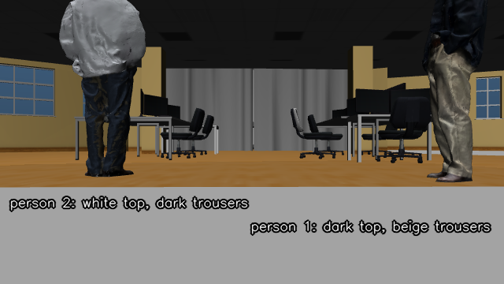
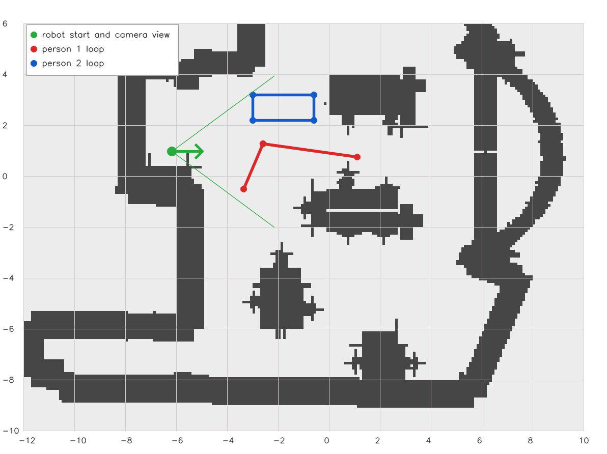
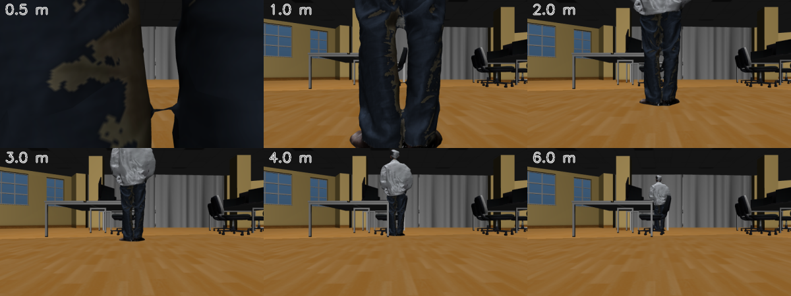

# Person tagging, navigation & following

Two simulation demos show a Go2 that can **find a person by what they wear**,
remember where it saw them, walk up to them, and **follow them with the A\*
planner**, re-planning whenever they move. Both run in the MuJoCo office with
walking people and need no hardware.

| Demo blueprint | Agent? | What it shows |
|---|---|---|
| `demo-unitree-go2-dynamic-goal` | No | The planner's goal follows a **scripted moving target**. Use it to see goal tracking on its own. |
| `demo-unitree-go2-agentic-person-following` | Yes | **Two** people walk different loops. You tell the agent in plain language which one to tag, go to, or follow. |

> **Experimental, simulation only.** These demos were built and checked in
> MuJoCo and on replay data. They have not been run on a real Go2, and they are
> not wired into `unitree-go2-agentic-persistent`. See [Limits and
> troubleshooting](#limits-and-troubleshooting) before relying on them.

> **In the web console.** Both agent stacks can also be started from the [web
> console](web-console.md#person-following-in-the-console), which adds **People**
> buttons, a follow-distance setting, and a persistent-map variant for a real robot.
> The console's follow distance defaults to 3 m, not the demo's 0.5 m, for the camera
> reason under [The camera sees legs when you stand close](#the-camera-sees-legs-when-you-stand-close).

## Run them

Prerequisites: the simulation extra
(`uv sync --extra sim --inexact --active`) and, for the agentic demo, an
`OPENAI_API_KEY` in `.env` (used by both the agent and the vision model).

```bash
# 1. Goal tracking only: no agent, no API key
dimos --simulation run demo-unitree-go2-dynamic-goal

# 2. The agentic demo
dimos --simulation run demo-unitree-go2-agentic-person-following
```

A bare `--simulation` selects MuJoCo. The robot starts at `(-6.18, 0.96)`. The
people **stand still for the first 10 s** so the robot can look around, then
start walking their loops.

Talk to the agent from a second terminal:

```bash
dimos agent-send "how many people do you see and what are they wearing?"
dimos agent-send "tag the person in the light gray long-sleeve shirt"
dimos agent-send "go to the person in the dark jacket"
dimos agent-send "follow the person in the light gray long-sleeve shirt with dark trousers"
dimos agent-send "stop following"
```

Watch progress with `dimos agentspy` or `dimos log -f`.

> **Use the vision model's own words.** The model describes the second person
> as a *light gray long-sleeve shirt with dark trousers* and the first as a
> *dark navy top with tan trousers*, not as a "white t-shirt". Ask the agent
> "who do you see?" first and reuse that wording; the agent does this itself
> when a description is ambiguous.



*What the robot's head camera sees at the start of the agentic demo.*

## How it works

```
 camera frame ──▶ vision model ──▶ box around the matching person
       │                                   │
       └── same-time lidar scan + TF ──────┤
                                           ▼
                              world position of the person
                                           │
          ┌────────────────────────────────┼───────────────────────┐
          ▼                                ▼                       ▼
     tag_person                    navigate_to_person   follow_person_with_planner
  (save / move a tag)             (one goal, 0.5 m short)  (repeat every 1.5 s)
                                                                   │
                                                                   ▼
                                                  GoalTracker ──▶ A* planner
                                       (re-plans when the person moved >= 0.5 m)
```

1. **Find.** `PersonNavigationSkillContainer` asks the vision model for the box
   of the one person matching your description. It is told to return nobody
   rather than a person who does not match.
2. **Locate.** The box is projected to a world position using the lidar scan and
   camera transform captured with *that same frame*, so the answer is correct
   even though the robot keeps moving while the model thinks.
   `SpatialMemory.locate_in_observation` does this without storing anything. If
   the box contains no lidar points the person is **not** given a guessed
   position (see [the lidar range](#the-simulated-lidar-and-its-range)).
3. **Act.** Tag, go to, or follow.

### Following

`follow_person_with_planner` looks again about every 1.5 s and hands the new
position to [`GoalTracker`](#goaltracker-dynamic-goals). Because the person is
**re-identified by appearance on every look**, the robot ignores the other
person even when they cross paths, and no tracker state can drift onto someone
else. It costs one vision-model call per look.

### When the person is lost

After `search_after_missed_looks` (2) looks in a row without finding them, the
robot:

1. **stops** (the planner goal is cancelled),
2. **faces where they were last seen**, if that is clearly off to one side,
3. **turns on the spot in 60° steps**, looking after each step, in that
   direction,
4. **resumes following** the moment they are seen,
5. **gives up** only if a full revolution finds nobody.

The agent is told when the search starts and when the person is found again.
Turning is closed loop on odometry yaw, aims at absolute headings so small
shortfalls do not add up, and always ends with a zero velocity command. Stopping
the follow skill interrupts a turn at once. Set `search_step_deg` to `0` to turn
the search off (it then gives up after `max_missed_looks`).

> **Not yet confirmed in the simulator.** The search is covered by unit tests
> with a simulated robot. Whether it recovers a person in the real MuJoCo run
> has not been checked; see the camera-height limit below, which can stop the
> person from being recognised at close range.

## Skills

| Skill | Arguments | What it does | Movement lock |
|---|---|---|---|
| `describe_visible_people` | none | Lists the people in view, how each is dressed, and a world position (`null` without lidar depth). Read only. | no |
| `tag_person` | `description` | Finds the person, locates them, and saves or moves the tag `person: <description>` with a photo crop. | no |
| `navigate_to_person` | `description` | Walks to about 0.5 m short of the person, facing them. If they are not visible it goes to their last tag and says how old it is. Starts navigation and returns. | released on return |
| `follow_person_with_planner` | `description` | Follows with the planner and searches if they are lost. A background skill that streams progress to the agent. | held until stopped |
| `stop_following_person` | none | Stops following and cancels the planner goal. | no |

Notes:

- `navigate_to_person` returning is **not** arrival, and it releases the
  `movement` lock while the robot is still walking, like the existing
  navigation skills.
- `stop_navigation` does not stop a follow in progress: the loop sends a new goal
  as soon as the person moves. Use `stop_following_person`.
- The stock `follow_person` (visual servoing, no obstacle avoidance, needs a Qwen
  key) is **disabled** in the agentic demo so the agent cannot pick it.
- The robot's system prompt gains a short *People* section in this blueprint
  only; the default prompt is unchanged.

### Person tags

`tag_person` stores a normal [memory tag](persistent-maps.md#querying-tags-navigating)
with `kind: person`:

- The name is `person: <description>`, with a reference photo cropped to the box.
- **Tagging the same description again moves the tag** and re-stamps it, instead
  of adding a duplicate. (Object tags merge only within 1 m and never move.)
- A person walks away, so a person tag is a **last-seen position**, not a
  location to trust. While following, the tag is refreshed on every sighting
  (`refresh_tag_while_following`).
- `query_memory_tags` lists them like any other tag; the `kind` field says
  `person`.

Two small RPCs were added to `SpatialMemory` for this and are inert unless
called: `locate_in_observation` (estimate a box's lidar position without storing
a tag) and `update_robot_location` (move a tag; refused during a PGO session).
The skills use their own narrow `PersonMemorySpec`; `SpatialMemorySpec` is
unchanged.

## `GoalTracker` (dynamic goals)

`GoalTracker` keeps the A\* planner's goal on a **moving target**. It watches a
stream of target positions and, once the target has moved far enough from the
last one it sent a goal for, publishes a new `goal_request`. The planner then
re-plans from where the robot is. The target is tracked as-is; its future
position is **not** predicted.

- It compares the target with the **last target a goal was sent for**, not the
  previous message, so slow drift adds up and eventually triggers an update, and
  the robot's own motion never does.
- Goals are rate limited, and a new target always sends one right after
  `start_tracking`.
- The goal stops `follow_distance_m` **short** of the target, facing it. Inside
  that distance plus 0.2 m (the planner's own arrival tolerance) it sends
  nothing, to avoid wiggling.
- Targets must be in the same frame as odometry; the planner ignores `frame_id`.
- RPCs: `start_tracking`, `stop_tracking` (also cancels the planner goal) and
  `update_target(x, y)`, so you can drive it by hand from `dimos shell`.

The dynamic-goal demo turns it on and feeds it the scripted person's true
position. The agentic demo leaves it off until the follow skill starts it and
feeds it the vision-based positions instead.

## The simulation additions

All of these are **off by default**, so existing blueprints and tests behave as
before.

### A second, differently dressed person

`--mujoco-second-person` adds a mocap body `person2` driven by `/person2_pose`.
It shares the first person's mesh, so the **face and build are the same and only
the clothes differ**. Its texture is made at start-up by recolouring the first
(navy top to white, beige trousers to dark blue), so no new binary asset is
stored. The mesh is jacket-shaped, so the vision model may call the white top a
shirt or a jacket.

`MujocoPersonTarget` walks both people on closed loops:



*Person 1 walks out and back along two legs known to be walkable; person 2 walks
a rectangle north of that, clear of furniture by at least 0.3 m, at least 0.9 m
from person 1's path, and inside the camera's horizontal field of view (about
±36°) from the start.*

### The simulated lidar and its range

The simulator builds its lidar from three depth cameras and, by default, **drops
everything more than 3 m away** (and anything above 1.2 m relative to the
camera). The people stand 3 to 6 m from the start and walk farther, so with the
default a person the vision model found had no lidar points in their box, and the
skills reported the person as not visible.

`--mujoco-lidar-max-range <metres>` raises the limit; the agentic demo sets
**8 m**. With the robot at its start, 3 of the 8 waypoint positions of the two
loops had no lidar depth at 3 m, and all 8 have it at 8 m. A longer range also
maps more of the room, so planner behaviour can differ slightly from the other
demos.

## Configuration

Flags follow the usual `--<module>.<field>` form. The defaults below are the
module defaults; the demo blueprints override the ones noted.

### `--personnavigationskillcontainer.*`

| Flag | Default | Meaning |
|---|---|---|
| `vlm-model` | `gpt-5.6-luna` | Vision model; uses `OPENAI_API_KEY` |
| `vlm-url` | none | An OpenAI-compatible endpoint instead of OpenAI |
| `follow-interval-s` | `1.5` | Time between looks while following |
| `approach-distance-m` | `0.5` | Stopping distance for `navigate_to_person` |
| `refresh-tag-while-following` | `true` | Keep the person's tag at their latest position |
| `search-step-deg` | `60` | Turn step while searching; `0` turns the search off; keep it under the camera's field of view |
| `search-after-missed-looks` | `2` | Misses in a row before searching |
| `search-turn-speed-rad-s` | `0.6` | Turn speed while searching (at most 1.0) |
| `max-missed-looks` | `4` | Misses before giving up, **only** when the search is off |

### `--goaltracker.*`

| Flag | Default | Meaning |
|---|---|---|
| `enabled` | `false` | Send goals from the start (the dynamic-goal demo sets `true`) |
| `update-threshold-m` | `0.5` | New goal once the target moved this far from the last one |
| `min-update-interval-s` | `0.5` | Minimum time between goals |
| `follow-distance-m` | `0.5` | Stop this far short of the target; `0` goes onto it |

### `--mujocopersontarget.*` and simulator flags

| Flag | Default | Meaning |
|---|---|---|
| `mujocopersontarget.track` | 4-point loop | Person 1's closed loop, as `(x, y)` points |
| `mujocopersontarget.speed-mps` | `0.25` | Person 1's walking speed (at most 0.5) |
| `mujocopersontarget.start-delay-s` | `10` | How long both people stand still at the start |
| `mujocopersontarget.publish-target` | `true` | Publish person 1's true position as the target (the agentic demo sets `false`) |
| `mujocopersontarget.second-person-track` | none | Person 2's loop (the agentic demo sets the rectangle) |
| `mujocopersontarget.second-person-speed-mps` | `0.2` | Person 2's walking speed |
| `mujoco-second-person` | `false` | Add the second person to the scene |
| `mujoco-lidar-max-range` | none (3 m) | Simulated lidar range in metres |

## Limits and troubleshooting

| What you see | Why | What to do |
|---|---|---|
| "visible, but too far away for the lidar to measure where they are" | The lidar has no points in the person's box, usually because they are beyond its range. | Raise `--mujoco-lidar-max-range`, or have the agent move closer (`move_to`, forward). |
| "No person matching '…' is visible" | The vision model did not find a match. | Ask the agent who it sees and reuse that wording, or turn the robot. |
| "…did not find them after turning all the way around" while the person is close | See the camera limit below. | Follow from farther away, or describe what is visible at close range (trousers). |
| The robot keeps walking after `stop_navigation` | A follow is still running. | Use `stop_following_person`. |
| Slow, costly following | One vision-model call per look, each taking a second or two. | Raise `follow-interval-s`; the person moves up to about 0.75 m between looks at 0.25 m/s. |

### The camera sees legs when you stand close

The head camera sits at **0.31 m** and looks straight ahead with a 45° vertical
field of view. The robot tells people apart by their **clothes**, but at its
default following distance of 0.5 m the camera sees only trousers:



*Renders of person 2 walking away from the robot. Within 2 m only legs are in
view; at 3 m the head is cut off; the whole upper body is in view from about
4 m.*

So a description such as "light gray shirt" cannot be matched once the robot has
closed in, and the follow ends as "lost". The default stopping distance of 0.5 m
suits following a target whose position is known (the dynamic-goal demo), not
re-identifying a person by their top. Setting
`--goaltracker.follow-distance-m` to about 4 should keep them recognisable; this
comes from the renders above and **has not been tried in the simulator**.

### Other limits

- The goal is replanned by sending a fresh goal each time, which restarts the
  local planner, so the robot may pause briefly at each update.
- `GoalTracker` alone does not notice a target that stops reporting; it keeps
  its last goal. The follow skill handles loss itself.
- The persistent planner (`unitree-go2-agentic-persistent`) has not been tried
  with any of this.
- Everything here ran in simulation. Real-camera field of view, real-lidar range
  and real-person appearance are untested.

## What has been checked

| Check | Result |
|---|---|
| Unit tests for the tracker, the skills (including the search with a simulated turning robot), the second person, the texture recolour and the new `SpatialMemory` RPCs | pass |
| Headless run of the agentic blueprint on recorded data, with the agent calling the real vision model | tools are exposed; describe, tag, navigate and follow-start all worked |
| Identifying and following the right person in the MuJoCo demo | confirmed by running it |
| The lost-person search in the MuJoCo demo | **not yet confirmed** |

## Related

- [Person recognition](person-recognition.md) — named people from a photo gallery
- [Perception: VLM captioning & object segmentation](perception-vlm.md)
- [Persistent maps & tagging](persistent-maps.md)
- [Testing & verification](testing.md)
