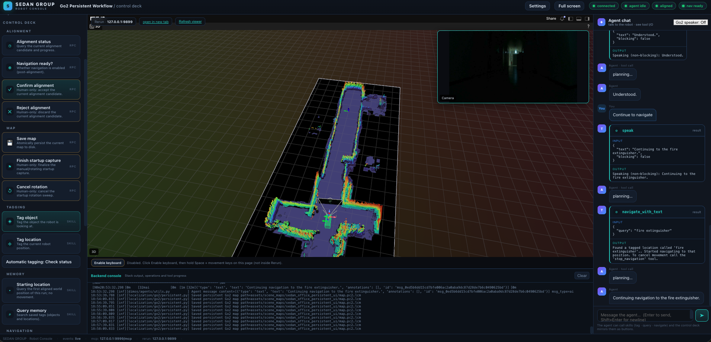

# The web console



The **web console** (`RobotConsoleModule`) turns the persistent workflow into a
browser control deck. It serves a single-page UI on `http://127.0.0.1:8090`
that embeds the existing Rerun web viewer and adds button-driven control of the
whole persistent workflow plus a **ChatGPT-style chat** that drives the agent.

Two ways to run it:

| Mode | Command | Notes |
|---|---|---|
| **Embedded** | `dimos run unitree-go2-agentic-persistent-console` | The console starts *with* the robot stack, including the original Rerun viewer and operation buttons, but **no** standalone Settings / start management. |
| **Standalone** | `python -m dimos.web.console` | A console **independent of the robot stack**. It launches and manages its own robot stack as a subprocess. Stop any existing stack first — the console only manages the stack it started. |

> **Do not start both consoles at once.**

## Choosing a stack and a connection

The standalone console's **Robot stack** panel has a **Blueprint** and a
**Connection** selector. Both are locked while a stack runs. (The embedded
console always runs the persistent stack.)

| Blueprint | Map | Agent chat | Connections | What the console shows |
|---|---|---|---|---|
| **Persistent map + agent** (default) | yes | yes | real robot, replay, simulation | Everything on this page. |
| **Persistent map + agent + people** (`unitree-go2-agentic-persistent-person-following`; in simulation `demo-unitree-go2-agentic-persistent-person-following`) | yes | yes | real robot, replay, simulation | Everything the persistent stack shows, plus a **People** group (see [Person following in the console](#person-following-in-the-console)). |
| **Go2** (`unitree-go2`) | no | no | real robot, replay, simulation | Camera, 3D view, keyboard control, logs, and Stop. Click goals in the 3D view. |
| **Dynamic goal (demo)** (`demo-unitree-go2-dynamic-goal`) | no | no | simulation | The same as Go2; the planner's goal follows a person walking a loop. |
| **Person following + agent (demo)** (`demo-unitree-go2-agentic-person-following`) | no | yes | simulation | The chat, the tag / query / navigate buttons that work without a map, and the **People** group (see [Person following in the console](#person-following-in-the-console)). |

How the selectors behave:

- A connection a blueprint cannot use is greyed out. Choosing a simulation-only
  demo switches **Connection** to **MuJoCo simulation** for you.
- The Settings dialog's **Replay** checkbox and the **Connection** selector are the
  same choice. If both are changed, replay wins.
- A stack **without a map** has no Map mode, no Alignment panel and nothing to
  save, so the stop button reads **Stop**. It is ready as soon as its blueprint
  reports that it has started.
- A stack **without an agent** has its chat input disabled and no **MCP tools and
  modules** button, because it runs no MCP server. Any operation the stack lacks
  is also refused by the server, not only hidden in the page.

### MuJoCo simulation

**MuJoCo simulation** starts the simulator instead of a robot:

- The simulator opens its **own window on this computer**, so it needs a display.
  The console's camera and 3D views are fed from the same streams as with a real
  robot. The Robot IP is not used.
- With the **Persistent map + agent** blueprint the map is always **New**: Map mode
  is hidden, and each start builds a fresh map in its own folder
  `~/.config/dimos/sim-scenes/<date>-<time>-<id>/`. There is no overwrite prompt,
  your real scene directory is never touched, and the newest five simulated scenes
  are kept (older ones are deleted; nothing outside that folder is).
- Restoring a saved map in simulation is not offered: the saved maps come from a
  real lidar.
- The Go2 speaker and Puppy microphone need a real Go2; switching them on in
  simulation reports that clearly.

> **Status.** Every launch command is checked against its real blueprint in the
> tests, and the Go2 and persistent stacks have been run through the console on
> replay data. Starting each stack in MuJoCo from the console, with the selectors,
> readiness, keyboard control and stop, was checked by hand on a display.

### Person following in the console

The two stacks with the person skills (see [person tagging, navigation &
following](person-following.md)) add a **People** group to the control deck:

| Button | What it does | Confirmation |
|---|---|---|
| **Describe people** | Lists who the robot can see, what each wears and where they are. Does not move the robot. | no |
| **Tag person** | Remembers where a described person is (a last-seen position). | no |
| **Go to person** | Walks up to the person and stops about half a metre away. | yes |
| **Follow person** | Follows the person with the planner, re-planning as they move. | yes |
| **Stop following** | Stops following and cancels the goal. | no |

- Type the description the way the vision model words it ("light gray long-sleeve
  shirt"). **Describe people** first shows that wording.
- **Go to person** and **Follow person** need navigation to be ready. On the
  persistent stack that means the map alignment is approved, as for every other
  navigation.
- **Stop navigation** and taking over with the keyboard also end a follow. Without
  that, a follow would keep sending goals as the person moves.
- Progress (found them, lost them, turning to look, gave up) appears in the chat's
  tool view, and the agent can do the same through chat.
- **Settings → Person following** sets the follow distance, how far the person must
  move before the robot re-plans, and the turn step used when searching for a lost
  person. The follow distance defaults to **3 m**: the robot's low camera only sees
  a person's legs from closer, and it tells people apart by what they wear.
- **Live person follow distance**, the slider at the bottom right beside the live
  navigation speed limit and the nearby stop distance, changes the gap while the
  robot runs. It takes effect at the robot's next re-plan (about every 1.5 s). The
  robot closes in to a smaller distance but does **not** back away when you raise
  it. It is session-only; the saved default is in Settings.
- In simulation the same two people walk their loops as in the demos. On a real
  robot, supervise in person: the robot walks toward and behind a real person.

> **Status.** The simulation side of these stacks, through the console, has not yet
> been confirmed by hand on a display. The real robot has not been tried.

## The module

`RobotConsoleModule` declares **no `In` / `Out` ports**, so it never competes
with the persistent stack's stream wiring. It only observes and publishes by
**channel name** through the shared transport. This is why the console can be
added to a blueprint without disturbing the map, planner, or perception wiring.

What it does:

- **Embeds the existing Rerun web viewer** by iframe — the original Rerun
  content is preserved, not replaced.
- Adds **button-driven control** of the workflow operations from the
  [persistent workflow guide](quickstart.md): alignment, map capture,
  object/location tagging, memory query, navigation, and stop.
- Adds a **chat** that sends text to the agent (`/human_input`) and renders the
  agent's replies (`/agent`), the robot's feedback, and the internal tool
  input/output (`/agent` tool messages + `/tool_streams`).
- Serves a **3D view** and a **camera** feed for the standalone console
  (loaded separately so the standard Rerun viewer is untouched).

## Standalone console

```bash
cd /path/to/dimos
source .venv/bin/activate
python -m dimos.web.console          # browser → http://127.0.0.1:8090
```

- The console listens on **127.0.0.1 only** — do not expose it to the public
  internet.
- Use `--port 8092` to change the console port. The console, MCP, and Rerun
  ports must all be different.
- When the robot stops the page still works. Stopping the console terminal
  (`Ctrl+C`, `SIGTERM`, or `SIGHUP`) **stops the robot stack the console
  started**: it sends `SIGTERM`, waits 5 s, then escalates to `SIGKILL`, and
  cleans up the stack's children. This is equivalent to `dimos stop` for the
  stack this console manages — **it does not stop stacks started elsewhere**.
- Closing only the browser does **not** stop the robot stack. A `kill -9` or
  power loss skips cleanup — check with `dimos status` and `dimos stop` if
  needed.

## Logging

The standalone console records **all of its execution output — including errors —
the backend, stored locally**, so it can be reviewed *after* the run. It does
**not** stream logs into the browser: the in-memory **Backend console** shows
only the most recent ~200 lines, while the logs written here persist to disk and
outlive the session.

See the **[Logging system](logging.md)** page for what is saved (`main.jsonl`
structured logs, `stack.log` captured stack output), where it is stored, the file
naming rules, the `--debug` flag, error capture, and how to view the logs.

> The **embedded** console (`dimos run unitree-go2-agentic-persistent-console`)
> uses the normal `dimos run` per-run logs (the CLI's own log directory and
> exception handler), not this standalone log directory.

## Settings

Top-right **Settings** configures (and, where relevant, saves for the next
start):

| Group | Configurable |
|---|---|
| **Connection** | Robot IP, Replay, replay dataset, on-board obstacle avoidance; read-only display of whether `.env` keys are configured. The blueprint and the real robot / replay / simulation choice are in the **Robot stack** panel (see [Choosing a stack and a connection](#choosing-a-stack-and-a-connection)). |
| **Model services** | Agent API base URL, Agent model, VLM API URL, VLM model |
| **Map** | Scene directory, manual/rotation capture, rotation speed/duration, PGO loop correction; **New / Restore** is chosen in the main Robot stack |
| **Auto tagging** | Room tagging on/off, object tagging on/off, travel-distance threshold, segmenter |
| **Services** | MCP port, Rerun web viewer port, Rerun data port (gRPC) |

Examples:

- Set the Robot IP to the real robot, e.g. `192.168.63.218`.
- For an OpenAI agent, the base URL is `https://api.openai.com/v1`; the VLM URL
  can be `https://api.openai.com`. Set the two model names separately, e.g.
  `gpt-5.6-luna`.
- The standalone console also uses this VLM URL/model for manual object
  tagging, so it does not depend on a separate cloud service. The model must
  support image input and return pixel coordinates.

**Where settings go:** ordinary settings save to
`~/.config/dimos/robot-console.json` (the system's DimOS config directory).
`OPENAI_API_KEY` and `UNITREE_AES_128_KEY` are read from `.env` in the project
root; Settings only shows a fixed mask and whether they are configured — the API
never returns the secret and does not accept editing it. Edit the secret in
`.env`; reopening Settings refreshes the status. Changes take effect on the
next start.

> Keep `.env` private (owner read/write only) and out of version control.

### Map mode on start

After saving, in the main **Robot stack → Map mode** choose **New map** or
**Restore saved map**, then click **Start**. (Map mode applies to the persistent
stack on a real robot or replay; a simulation always builds a new map.) Changing a setting or mode while
running requires a normal stop first.

- **Restore** keeps the same scene directory; choose Restore and start — there
  is no map-selection prompt. A missing `map.pc2.lcm` is a clear error and
  never auto-creates or overwrites data.
- **New** always shows a confirmation: an empty directory shows **Create new
  map?**; an existing map/tags shows **Overwrite existing scene?**. Cancel
  changes nothing and does not start. On confirm, the old scene is moved to a
  sibling `.backup-<unique>` directory (shown in the Backend console); the new
  stack still uses the original scene path and does not load the old tags.
  If the start process fails, the console restores the old directory.
- On **Port 9877 is occupied**, change **Rerun data port (gRPC)** in Settings
  (e.g. `9887`), save, then start. Changing the Rerun *viewer* port does not
  fix a data-port conflict; do not kill unknown processes.

## UI operations

| Tutorial operation | UI entry |
|---|---|
| Start / connect | Settings → **Start**; on failure read **Stack logs** |
| Status, modules, tools | top status badges; **MCP tools / Tools & modules** |
| Camera, map, trajectory | central view: 3D main view, camera floating top-right; click the floating window to swap sizes without reloading sources |
| Auto tagging | Settings room/object toggles, effective on the next start |
| Manual object tag | **Tag object** → `object_name` |
| Manual place / return point | **Tag location** → `location_name` |
| Query & coordinates | **Query memory** → empty query lists all; results show ID + coordinates |
| Navigate by ID | the query result's **Navigate**, or **Navigate to tag** → `location_id`; needs human confirmation |
| Cancel navigation | **Stop navigation** (not a hardware emergency stop) |
| Navigation state | **Navigation state**; "started" is not "arrived" |
| Alignment capture | main **Restore**, Settings **manual** → drive → stop → **Finish startup capture** |
| Alignment check | **Alignment** panel: phase, candidate number, metrics, failure reason; **View candidate** opens the colored overlay + heading preview, **Back to normal view** returns |
| Confirm / reject alignment | **Confirm alignment** / **Reject alignment**, both human-confirmed; disabled without a candidate; the confirm binds the current candidate |
| Cancel rotation | **Cancel rotation** |
| Save map | **Save map** shows the RPC result or a clear error |
| Pause / resume map fusion | **Pause map fusion** / **Resume map fusion**, human-confirmed; does not stop the robot or freeze the pose |
| Map fusion status | **Map fusion status** + Map area status text (reason, accepted/skipped frame counts) |
| Save and stop | **Save and stop** takes the map-save result first, then stops normally; a failed save does not auto-exit or force-kill |
| Chat | right-side input; Enter sends, Shift+Enter is a newline; shows replies, paired tool input/output, and live tool progress |
| Log | left **Operation log**; **Backend console** below Rerun shows background output, operations, and tool progress (clearable) |
| Full screen | header **Full screen** / **Exit full screen** (or `Esc`) |

### Alignment candidate check

After a Restore capture, the **Alignment** panel shows `waiting`, `matching`,
`candidate`, or `ready`, plus scan count, point count, match count, and
failure reason. When a candidate appears, click **View candidate**:

- **blue** = the old map transformed into this session's coordinates
- **orange** = the scan
- **green arrow** = the robot's current forward direction

The panel's position and angle are the candidate's **old-map coordinates**
(+X = 0°), not the preview's session coordinates. Without a robot pose the
heading cannot be shown — wait for the pose and inspect before confirming.

Check walls, corners, robot position, and **actual heading** together.
Fitness and RMSE are match metrics, **not** correctness — a symmetric corridor
can score high with the wrong heading. The confirm button binds the candidate
that was open when you clicked; if the candidate changes you must re-inspect.
Rejecting retries on later scans; in manual-capture mode it retries the frozen
cloud — to re-capture, stop and re-Restore. This version does **not** change
the matching algorithm or threshold.

### Saving the same scene after Restore

**Save and stop** updates `map.pc2.lcm` in the **same** scene Settings
configured — it does not create another map file, clear tags, or reset
coordinates. The map keeps unseen old regions and updates the aligned, fused
observations of this session; the UI shows the save path and accepted/skipped
scan counts. After a successful save it stops accepting new map frames, so the
final save and the exit write stay consistent.

If alignment is unconfirmed, there are no accepted scans, PGO sync fails, or the
file write fails, the UI shows a clear error and keeps the running stack — it
does **not** pretend it saved. In particular, while fusion is **paused**, live
scan changes in Rerun do **not** mean the permanent map grew: check the fusion
status and accepted count first. It will not auto-start fusion or bypass
alignment. To keep the current map, **pause, then save**.

## Keyboard control

Under the central view, **Enable keyboard** (after confirmation) holds
`Space` + `W/S` (forward/back), `A/D` (strafe), `Q/E` (turn); `Esc` stops and
disables. This reuses `tele_cmd_vel` and `MovementManager` and **cancels
navigation**; it does not require completed alignment (so it supports startup
manual capture). **Supervise in person — this is not a hardware emergency
stop.**

- Keyboard works only when the console page has focus, is not editing an input,
  and no dialog is open. Clicking the Rerun iframe loses focus; click the
  console title to re-enable.
- Releasing keys, losing focus, hiding the page, or closing the connection
  sends a zero velocity; the server also stops after 0.5 s without a command.
- Enabling first asks the Go2 to open joystick listening; failure shows an
  error and does not enter a controllable state. Direction buttons also work;
  release stops.

## Auto tagging toggle

Under **Tagging**, **Automatic tagging** reads its status on first click, then
pauses/resumes the automatic object/room tagging configured in Settings on the
next start. Manual tagging is unaffected. Turning it off stops submitting new
tasks, clears pending tasks, and discards stale results; an already-sent model
request cannot be withdrawn. Resuming reuses the tagging types configured at
start; it does not auto-enable types that are off in Settings.

## Starting location

Each robot-stack start records a **Starting location** (the first aligned world
pose). On a restored map you must align first — it is **not** the previous run's
start. **Return to start** (Navigation) confirms and then navigates; the agent
can call the same query and return tools. Returning still passes the planner's
alignment / readiness check — starting navigation is not arriving.

## Go2 speaker and "Puppy"

See [movement, speech & arrival](movement-and-arrival.md) for the full
behaviour. In brief: **Go2 speaker** replays the agent's final replies through
the Go2's own audio (default off, 10/10 volume, playback-replay/sim rejected);
**Puppy** (console-only) adds ambient commentary and half-duplex microphone
conversation. These are **not** a hardware stop and never call motion tools
themselves — give navigation commands in the web agent chat.

## Offline testing vs. real hardware

The console's tests isolate the robot, LLM, and lifecycle boundaries — they do
not start a real robot or call the cloud API. They verify UI / HTTP / SSE,
parameters, saving, and key handling; they **cannot** prove real-hardware
navigation or vision. For a real-hardware acceptance run, see
[testing & verification](testing.md).
